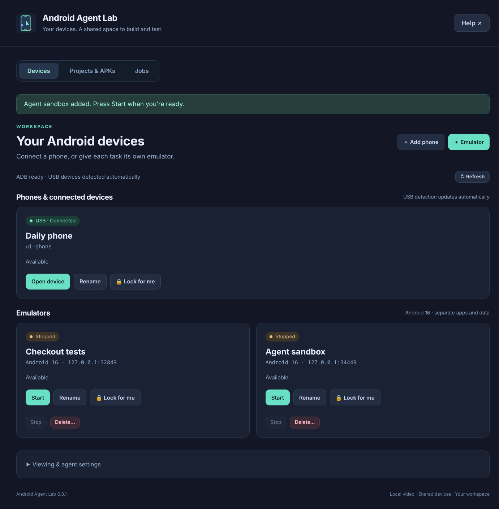

# Android Agent Lab

A Linux workspace where you and your coding agents build, install and test apps on the same Android phones and emulators.

<p>
  <a href="https://github.com/Hashim-K/android-agent-lab/releases/latest"><picture><source media="(prefers-color-scheme: dark)" srcset="https://shieldcn.dev/github/Hashim-K/android-agent-lab/release.svg?logo=github&amp;variant=outline&amp;mode=dark&amp;v=0.3.1"></picture></a>
  <a href="https://aur.archlinux.org/packages/android-agent-lab-bin"><picture><source media="(prefers-color-scheme: dark)" srcset="https://shieldcn.dev/badge/AUR-package-1793D1.svg?logo=archlinux&amp;variant=outline&amp;mode=dark"></picture></a>
  <a href="https://github.com/Hashim-K/homebrew-tap/blob/main/Formula/android-agent-lab.rb"><picture><source media="(prefers-color-scheme: dark)" srcset="https://shieldcn.dev/badge/Homebrew-tap-FBB040.svg?logo=homebrew&amp;variant=outline&amp;mode=dark"></picture></a>
  <a href="https://copr.fedorainfracloud.org/coprs/hashimkarim/android-agent-lab/"><picture><source media="(prefers-color-scheme: dark)" srcset="https://shieldcn.dev/badge/Fedora-COPR-51A2DA.svg?logo=fedora&amp;variant=outline&amp;mode=dark"></picture></a>
  <a href="https://launchpad.net/~hashimkarim/+archive/ubuntu/android-agent-lab"><picture><source media="(prefers-color-scheme: dark)" srcset="https://shieldcn.dev/badge/Ubuntu-PPA-E95420.svg?logo=ubuntu&amp;variant=outline&amp;mode=dark"></picture></a>
</p>



*The device workspace, shown with demonstration devices.*

- **One shared Android screen.** Interact in the desktop app or a browser preview while Codex, Claude Code or T3 uses coordinated ADB access. Named agent cursors are optional.
- **Phones and Android 16 emulators.** Discover USB devices, pair over Wi-Fi, and create, rename, start, stop or delete separate emulator instances.
- **Projects and APKs in one library.** Open a project with `android-agent-lab .`, discover its build settings and installed toolchains, then build, install, launch or collect logs. Copy job output or clear finished jobs.
- **Reserve devices for your work.** Shared claims and handoffs coordinate agent threads; **Lock for me** keeps a device reserved across app restarts.
- **Direct scrcpy video.** H.264 decoding, continuous touch gestures and developer toolbars outside the phone screen. **No cursors** preserves your system pointer and turns off overlay work.

## Install

Use your distribution's package channel for updates, or download a portable
AppImage. All channels below are published community packages maintained by this
project. The desktop app needs **glibc Linux, X11 or Wayland, Python 3.10+ and ADB**;
native packages install their declared dependencies. Docker is optional for phones.

| System / channel | CPU | Recommended installation |
| --- | --- | --- |
| Arch Linux / compatible Arch Linux ARM | x86_64, aarch64 | [AUR](docs/distribution.md#arch-linux-and-derivatives): `yay -S android-agent-lab-bin`, or the helper-free instructions |
| Fedora 43 / 44 | x86_64, aarch64 | [Enable COPR, then install](docs/distribution.md#fedora-43-and-44) with `dnf` |
| Ubuntu 24.04 LTS (Noble) | amd64 | [Add the PPA, then install](docs/distribution.md#ubuntu-2404-lts-amd64) with `apt` |
| Homebrew on Linux | x86_64, ARM64 | [Homebrew prerequisites](docs/distribution.md#homebrew-on-linux), then `brew install hashim-k/tap/android-agent-lab` |
| Direct downloads for glibc Linux | x86_64, ARM64 | [AppImage, DEB, RPM, Arch and tar archives](https://github.com/Hashim-K/android-agent-lab/releases/latest); [verify and install](docs/desktop.md#choose-a-package) |

The PPA is specific to Ubuntu Noble; ARM64 users can use the direct DEB. Direct
packages on other distributions must meet the [runtime requirements](docs/desktop.md#choose-a-package).
Local Docker emulators additionally need **x86_64, Docker Compose, `/dev/kvm`,
about 25 GB of disk space and up to 6 GB RAM per running instance**. ARM64 desktops
can use physical devices and remote ADB hosts.

See [install, upgrade and uninstall instructions](docs/distribution.md),
[portable installation](docs/desktop.md#appimage-and-application-menu-installation),
or [build the desktop app from source](docs/desktop.md#build-and-verify).

## First run

```bash
android-agent-lab --version
android-agent-lab
```

The first command prints the installed version; the second opens the workspace.
Connect a USB phone with USB debugging enabled and accept its authorization
prompt, or choose **Add phone** for wireless pairing. Choose **Open device**, then
**Copy browser URL** to use that same screen in a Chromium browser or preview pane.

In the app, **Install agent skills** adds the live-device and project skills for
Codex, Claude and T3. **Copy agent instructions** provides the session details for
your thread. Keep that URL and those instructions private: they include access
to the shared session.

From a Gradle project's root, run `android-agent-lab .` to add or reopen it in
**Projects & APKs**. Opening a project preserves its saved settings and does not
run a build. See the [terminal guide](docs/desktop.md#open-a-project-from-the-terminal),
[workspace guide](docs/desktop.md#phones-multiple-emulators-and-locks),
[viewer and latency guide](docs/streaming.md), and [troubleshooting](docs/troubleshooting.md).

## Start the Docker emulator from source

Requires a **Linux x86_64 host with working `/dev/kvm`**, Docker Engine with Compose,
Python 3.10+, and Android SDK platform-tools (`adb`). Allow about 25 GB for the
image, build layers, and Android data; the container has a 6 GB memory limit. The Compose setup
is not a native macOS/Apple Silicon emulator solution. A browser on another OS
can connect to a suitable Linux host through an SSH tunnel.

```bash
git clone https://github.com/Hashim-K/android-agent-lab.git
cd android-agent-lab
python3 scripts/lab.py init
python3 scripts/lab.py doctor
python3 scripts/lab.py up
python3 scripts/lab.py url --with-password
```

Open the printed URL in your browser or the client's browser preview pane. It
contains your local VNC password, so keep it private. `url` without the flag
opens a password prompt; the password is in `.env`.

The first start downloads the upstream image and builds the Android 16 addition.
`up` waits up to five minutes for
Android's `sys.boot_completed=1`; use `up --timeout 600` for a slower first boot.
A running container alone does not mean the emulator is ready.

Click, drag, and type in the emulator window through noVNC. Its side toolbar
provides Home, Back, rotation, and extended emulator controls. Build your app
with its existing Gradle project and install the resulting APK through ADB.
This shows a running Android app; Android Studio's Compose/layout design-time
previews and Layout Inspector are separate IDE features.

## Direct video in the preview pane

For direct Android capture with browser controls, install the optional viewer
dependencies (Node.js 22+ and npm required), then claim the running device:

```bash
python3 scripts/video.py setup
python3 scripts/lab.py claim --owner 'human:your-name' --note 'Interactive browser session'
python3 scripts/video.py start --serial 127.0.0.1:15555 --token '<claim-token>' --control --port 8766
```

Open its printed private URL in a Chromium browser or the preview pane. Click,
drag, type, and use Back/Home/Recents. The browser decodes H.264 from the official
scrcpy Android server; a native desktop window is optional. The viewer also
accepts a physical phone's serial and needs no Docker for that case.

**Agent cursors** show where coordinated agent taps and drags happen, with
separate names and colors in every browser view. Typing and navigation appear
as activity labels. Choose **No cursors**, **Agents only**, or **Agents and user**; the user
pointer is a small circle that follows hovering continuously. See
[cursor attribution](docs/streaming.md#agent-cursors) for shared-session labels.

Omit `--control` for read-only video. Every input checks the shared claim;
handoff or expiry stops the old stream. Video alone does not renew ownership.
Ctrl+C stops the viewer, leaving the device and claim intact. Current browser
input sends continuous single-pointer gestures through scrcpy, including holds,
drags, scrolling, and explicit Unicode clipboard paste. Developer toolbars sit
outside the phone screen: navigation, rotation, volume, screenshots, recording,
APK installation, Logcat, and UI hierarchy inspection.
See [setup, limits, and performance tradeoffs](docs/streaming.md) for details.

## Let an agent use it

```bash
python3 scripts/lab.py status
python3 scripts/lab.py claim --owner 'codex:unique-thread-id' --note 'Verify login'
```

Retain the returned token in this thread. Set `ADB_COORD_TOKEN` only in its
process environment, or pass `--token` before the ADB command separator:

```bash
python3 scripts/lab.py adb --token '<claim-token>' -- install -r /absolute/path/app-debug.apk
python3 scripts/lab.py adb --token '<claim-token>' -- shell am start -W -n com.example.app/.MainActivity
python3 scripts/lab.py adb --token '<claim-token>' -- shell input tap 500 800
python3 scripts/lab.py screenshot --token '<claim-token>' --out /tmp/android-screen.png
python3 scripts/lab.py release --token '<claim-token>'
```

Use a new screenshot path; the command refuses to overwrite an existing file.
Agents can inspect that screenshot and use Android UI hierarchy information
for native widgets. A browser DOM snapshot only sees the viewer controls/canvas.

Every cooperating thread uses the same per-device claim registry on the ADB
host. Claims default to 30 minutes, renew during commands, reject competing
owners, and rotate tokens on handoff:

```bash
python3 scripts/lab.py handoff --token '<claim-token>' --owner 'claude:next-thread-id' --note 'Login open; next: verify validation'
```

Pass the returned new token to that thread through your normal handoff mechanism.
No chat history synchronization or messaging service is included.

**Humans and agents share one Android screen.** Both can interact, but take turns
when a test depends on stable UI state. Hand off to `--owner 'human:your-name'`
for a human session, which makes cooperating agents wait. Start a fresh video
viewer with the new token; handoff revokes the old viewer. For noVNC, releasing
the agent claim also allows a human turn without restarting a viewer. noVNC,
raw ADB, native scrcpy, and Android Studio do not enforce these claims.
This is cooperative coordination, not a security boundary or a distributed lock.

## Install the skill

Keep this checkout and link its self-contained skill into the relevant clients:

```bash
mkdir -p "$HOME/.codex/skills" "$HOME/.claude/skills" "$HOME/.agents/skills"
ln -s "$PWD/skills/adb-coordination" "$HOME/.codex/skills/adb-coordination"
ln -s "$PWD/skills/adb-coordination" "$HOME/.claude/skills/adb-coordination"
ln -s "$PWD/skills/adb-coordination" "$HOME/.agents/skills/adb-coordination"
```

These commands deliberately fail if a skill already occupies a destination;
inspect the existing installation before replacing it. Refresh the provider
session after installation. In an existing thread, ask it to read the absolute
path to `skills/adb-coordination/SKILL.md` and give it this checkout's path.
T3 Code uses its selected provider's skill support; install on the host where
that provider executes. See [client and remote setup](skills/adb-coordination/references/clients.md).

The skill includes [live physical-device coordination](skills/adb-coordination/references/devices.md)
for USB and wireless phones/tablets, [live video instructions](skills/adb-coordination/references/video.md),
and a self-contained browser screenshot fallback with optional claim-checked
input. Its coordinator uses the same state
format as the standalone personal skill. Use `adb_coord.py --serial` commands
for those devices; `lab.py` specifically targets the Docker emulator.

## Operation

```bash
python3 scripts/lab.py status
python3 scripts/lab.py wait --timeout 60
python3 scripts/lab.py down
```

`down` refuses to stop an actively claimed device without its owner's token.
It preserves the named Android data volume. Stop and release claims before
changing the ports or image. Direct Docker commands bypass the coordination
checks.

The Dockerfile pins the upstream base by digest and installs
`system-images;android-36.1;google_apis;x86_64` from Google's stable SDK channel.
The base tag says `emulator_14.0`, but the running guest is Android 16 and uses a
Pixel 9 profile. This is an API image with Google APIs, not a Google Play Store
image. Android 17 has not been validated with the final graphics configuration;
see the troubleshooting record. The SDK package revision can change on an uncached rebuild; it is not
pinned by the base-image digest. Keep the built image if you need an identical
runtime later.

The `android16-avd` and `android16-config` volumes preserve the AVD and its SDK
configuration. Runtime launcher files come from the image, so updates are not
shadowed by an old home directory. Back up both volumes before upgrades. Use
separate volumes when changing Android major versions; the launcher does not
migrate Android data. The adapter fixes upstream's Pixel profile-name check
so that a normal restart reuses the existing AVD.

The AVD has an 8 GB data partition. `EMULATOR_DATA_PARTITION` in Compose applies
when the AVD is created; changing it is not a migration for an existing volume.
Upstream's 550 MB default is too small for this image's first boot.

Both published ports bind to `127.0.0.1`: browser `8765`, ADB `15555`. Change
`WEB_PORT` and `ADB_PORT` in `.env` if needed. Use 1–8 ASCII letters/digits for
`VNC_PASSWORD`; VNC's password format only uses eight characters. Keep `.env`,
claim tokens, APKs, and app data out of version control. Keep the ADB port local
or SSH tunneled; the VNC password does not protect ADB.

Upstream behavior analytics is disabled with `USER_BEHAVIOR_ANALYTICS=false`.
See [troubleshooting](docs/troubleshooting.md) for boot logs and graphics options.

## Why this repository exists

The desktop and browser viewer reuse official [scrcpy](https://github.com/Genymobile/scrcpy)
and [Tango](https://tangoadb.dev/scrcpy/). The Docker adapter reuses
[budtmo/docker-android](https://github.com/budtmo/docker-android) for emulator
execution, desktop input and noVNC. A small derived Dockerfile adds Google's
Android 16 / API 36.1 image, a version mapping and a Pixel data-persistence fix
to the upstream launcher.

| Project | Fit |
| --- | --- |
| [budtmo/docker-android](https://github.com/budtmo/docker-android) | Browser control through noVNC and ADB in one image; selected here. |
| [HQarroum/docker-android](https://github.com/HQarroum/docker-android) | Lean headless emulator; good for ADB/CI or native scrcpy, with a separate component needed for a browser viewer. |
| [Shmayro/dockerify-android](https://github.com/Shmayro/dockerify-android) | Another emulator option with a scrcpy-web companion; useful if that streaming approach is preferred. |

The useful addition here is shared ownership across agent threads, explicit
device targeting, handoffs, and a checked startup path. Upstream owns the hard
emulator/browser infrastructure. More elaborate queues, enforced human/agent
control arbitration, and an MCP adapter can be added if real workflows need them.
Current upstream comparisons are recorded in [the reuse decision](docs/reuse.md).

For app creation, SDK management, documentation, and advanced UI inspection,
use [Google's Android CLI](https://developer.android.com/tools/agents/android-cli)
and [official Android skills](https://github.com/android/skills). Those complement
this repository's ownership protocol. Device actions from any other tool must
still respect the current claim; they do not automatically take our operation
lock. Full browser-hosted Android Studio is a separate option when you need the
IDE's inspectors and design-time features.

## Development and licenses

The Python helpers use the standard library; the optional video bridge uses
locked npm dependencies. Automated tests use fake ADB and temporary claims;
they do not touch connected devices:

```bash
python3 -m unittest discover -s tests -v
python3 scripts/lab.py init
docker compose config --quiet
npm ci --prefix viewer
npm run build --prefix viewer
npm test --prefix viewer
node --check viewer/server.mjs
```

These tests cover coordination, launcher behavior, preview access, and video
input permissions. Emulator boot and browser video/input require separate live
testing; see [troubleshooting](docs/troubleshooting.md) and the
[video verification record](docs/streaming.md#verification-record).

Original code in this repository is [MIT licensed](LICENSE). The upstream
container, Android SDK/system images, noVNC, scrcpy, Tango, and other dependencies retain
their own licenses. In particular, see
[budtmo's license](https://github.com/budtmo/docker-android/blob/master/LICENSE.md).
This project is independent of those projects and of the agent clients.
